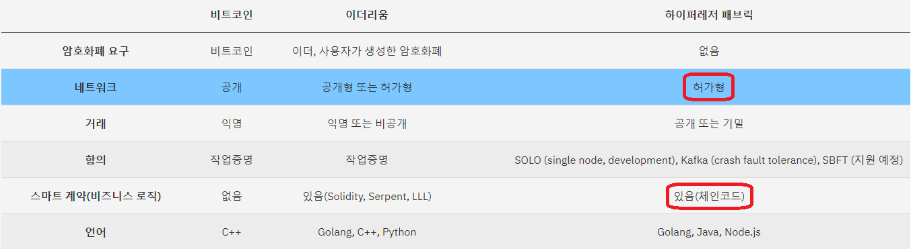
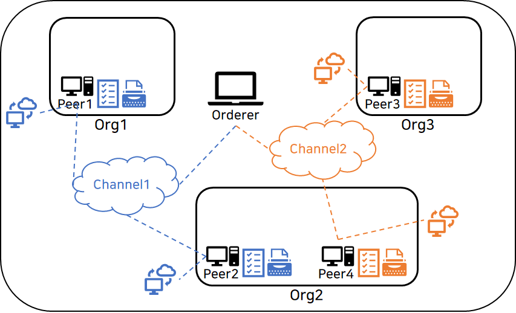
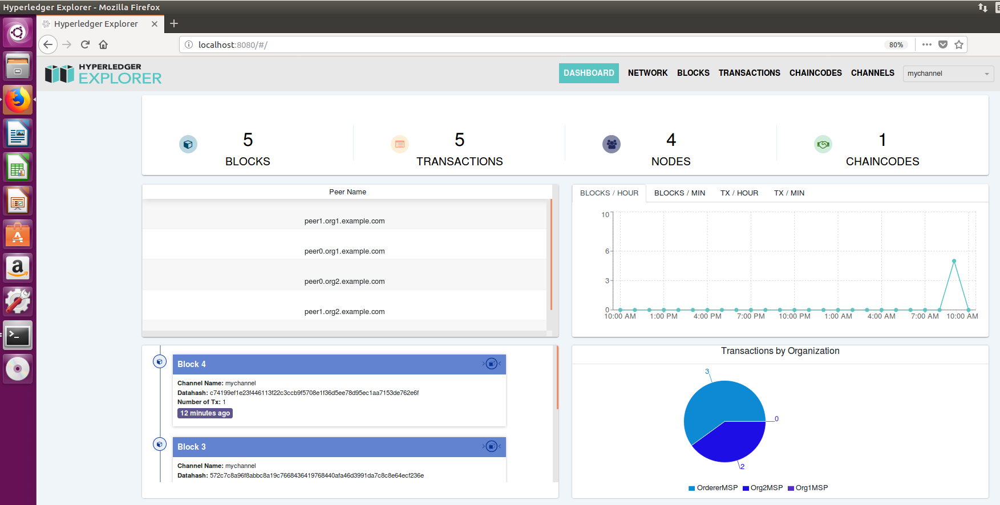

# BlockChain

블록체인의 개념 이해와 Hyperledger Fabric을 사용한 실습 및 연구 [](https://hyperledger-fabric.readthedocs.io/en/latest/index.html) [](
https://www.ibm.com/kr-ko/blockchain/hyperledger?p1=Search&p4=43700052661683012&p5=e&cm_mmc=Search_Google-_-1S_1S-_-AS_KR-_-%ED%95%98%EC%9D%B4%ED%8D%BC%EB%A0%88%EC%A0%80%20%ED%8C%A8%EB%B8%8C%EB%A6%AD_e&cm_mmca7=71700000065178082&cm_mmca8=aud-382859943522:kwd-826282347286&cm_mmca9=CjwKCAjw_qb3BRAVEiwAvwq6Vup_ISx8REow-0sy5_lxcM54YzWUTSeJOnuQAyJmP2BRAGISZirKxxoCG3gQAvD_BwE&cm_mmca10=427974933510&cm_mmca11=e&gclid=CjwKCAjw_qb3BRAVEiwAvwq6Vup_ISx8REow-0sy5_lxcM54YzWUTSeJOnuQAyJmP2BRAGISZirKxxoCG3gQAvD_BwE&gclsrc=aw.ds) [](https://github.com/IBM-Blockchain-Archive/marbles)

## Hyperledger

- 2015년 12 월 Linux Foundation 주도 하에 산업간 블록체인 기술 발전을 위해 조직된 전 세계적인 Open Source 협업 활동 중
- 금융, 뱅킹, 사물인터넷, 공급망, 제조 및 기술 분야의 총 130개 이상 회원이 Hyperledger Fabric, Composer 등 8개 프로젝트에 현재 참여 중
- 표준화된 개방형 엔터프라이즈급 분산 원장 프레임워크 및 코드 베이스 개발을 진행 중.



## Hyperledger Fabric

- Hyperledger Project 중 가장 활발한 활동 중인 Modular Architecture를 이용한 application/solution 개발을 가능케 해주는 Framework
- 허가형(Permissioned) Private Blockchain의 형태로 인증 관리 시스템에 의해 허가된 사용자만 BlockChain Network에 참여 가능하다.
- 모든 노드가 동일한 원장(Ledger)으로 정보를 공유할 수도 있고, business 목적에 따라 공유하고자 하는 노드 간에만 `Channel`을 제공하여 `별도의 원장 생성`도 가능하다.

### ■ Hyperledger Fabric Component

- 구성요소에는 분산원장(Distributed Ledger), 체인코드(Chaincode), Peer, Orderer가 있다.
	- `분산원장` : 현재의 상태를 저장해 놓은 DB인 `World State`와 상태변화에 대한 모든 Log 기록은 저장되어 있는 `Blockcahin`으로 구성
	- `체인코드` : 원장에 새로운 내용을 업데이트 하거나 기존의 내용을 읽어 오기 위해 필요
		- 체인코드 실행을 요청하는 트랜잭션이 발생하면 3단계`(execution - ordering - validation`)의 과정을 거쳐 원장에 `dApp`을 통해 기록되고 사용자에게 결과를 반환한다.
	- `Peer` : 이 원장과 체인코드를 관리하며 패브리 네트워크를 구성하는 노드로 수행하는 역할에 따라 4가지로 구분
		- `Endorsing peer` : 체인코드 시뮬레이션을 통해 트랜잭션이 적절한지 판단하는 역할 수행. 3단계의 과정 중 execution에 해당
		- `Committing peer` : 모든 peer가 수행하는 역할로, 최신 블록에 대한 검증 수행. 위의 3단계의 과정 중 validation에 해당
		- `Anchor peer` : 다른 조직과의 통신을 위해 다른 조직의 peer와 통신하는 역할 수행
		- `Leader peer` : orderer와 연결되어 최신 블록을 전달 받아 조직 내 다른 peer들에게 전송하는 역할 수행
	- `Orderer` : Endorsing peer들이 시뮬레이션을 통해 적절하다고 판단한 트랜잭션들을 모아서 정렬한 후 실제 블록을 생성하는 노드, 트랜잭션의 순서를 정렬하는 방법에 solo와 kafka방식으로 2가지가 존재
		- `solo` : 보통 테스트용으로 orderer 하나가 정렬 및 블록 생성의 모든 과정을 담당하는 방식
		- `kafka` : 분산 메시징 시스템인 kafka cluster를 통해 orderer가 트랜잭션을 정렬하고 블록을 생성하는 방식




- Fabric에서는 chaincode 실행을 요청하는 transaction부터 ledger에 기록되는 과정을 통틀어 `합의`라고 한다.
- 패브릭에서는 사용자의 권한 및 인증을 위해 MSP(Membership Service Provider)라는 인증 관리 시스템을 사용하는데, 여기에 네트워크 내 노드의 역할과 권한 등이 정의되어 있다.
- 이러한 MSP를 발급하고 관리하는 역할을 하는 기관을 CA(Certificate Authority)라고 한다.하이퍼레저 패브릭에서는 `Fabric-CA 노드`가 그 역할을 수행한다.
- CA노드를 통해 1차적으로 사용자의 서명과 권한 등을 확인하고, peer를 통해 원장에 기록되기 전에 보증 정책(Endorsement Policy)을 준수하는지 확인하는 과정을 거친다.
- 보증 정책은 보통 해당 트랜잭션이 지정된 peer들의 허가를 받아야 한다는 내용인데, 원장을 공유하는 채널 별로 참여자들은 다양한 방식으로 보증 정책을 설정할 수 있다.

---

## Hyperledger Fabric 개발 환경 구축


### ■ 1. Prerequisites [](https://hyperledger-fabric.readthedocs.io/en/latest/prereqs.html)

- Nodejs 8.11.x and above (9.x is not yet supported)
- PostgreSQL 9.5 and above
- jq
- docker-ce
- docker-compose
- GO Lang

#### docker-ce 설치

```bash
$sudo apt update
$sudo apt upgrade
$sudo apt -y install apt-transport-https ca-certificates curl software-properties-common
$curl -fsSL https://download.docker.com/linux/ubuntu/gpg | sudo apt-key add -
$sudo add-apt-repository "deb [arch=amd64] https://download.docker.com/linux/ubuntu $(lsb_release -cs) stable"

$sudo apt update
$sudo apt -y install docker-ce
```

- Docker Group 추가 후 현재 사용자 도커 그룹에 편입 후 `재 로그인` 필수

```bash
$sudo usermod -aG docker explorer
$su - explorer
```

#### Docker Compose 설치

```bash
$sudo apt -y install docker-compose
```

#### Go LANG 설치

```bash
$wget https://dl.google.com/go/go1.10.4.linux-amd64.tar.gz
$sudo tar -C /usr/local -xzf go1.10.4.linux-amd64.tar.gz
$echo 'export PATH=$PATH:/usr/local/go/bin' >> ~/.profile
$cd
$mkdir go
$echo "export GOPATH=$PWD/go" >> ~/.profile
$echo "export GOROOT=/usr/local/go" >> ~/.profile

$source ~/.profile

$echo "export PATH=$PATH:$GOROOT/bin" >> ~/.profile

$source ~/.profile
```

#### Nodejs, npm 설치

```bash
$curl -sL https://deb.nodesource.com/setup_8.x | sudo bash -
$sudo apt install nodejs
$node --version
$npm --version
```

#### GNU make, gcc/g++, libtool 설치

```bash
$sudo apt -y install make gcc g++ libtool
```

#### prereqs-ubuntu.sh을 이용하여 한번에 설치하기

```bash
$curl -O https://hyperledger.github.io/composer/latest/prereqs-ubuntu.sh
$chmod u+x prereqs-ubuntu.sh
$./prereqs-ubuntu.sh

# Go Lang 설치
$wget https://dl.google.com/go/go1.11.2.linux-amd64.tar.gz
$tar -xzvf go1.11.2.linux-amd64.tar.gz
$sudo mv go/ /usr/local

# 환경변수 설정
$vi ~/.bashrc
#(add these 2 lines to end of file)
export GOPATH=/usr/local/go
export PATH=$PATH:$GOPATH/bin

# jq 설치 후 재로그인
$sudo apt-get install jq
$exit
$su - explorer
```

---

### ■ 2. Install Samples, Binaries and Using the Test Network

#### Hyperledger Fabric 최신 버전 설치

```bash
$curl -sSL https://bit.ly/2ysbOFE | bash -s

$echo "export FABRIC_HOME=$HOME/fabric/fabric-samples/bin" >> ~/.profile
$echo "export PATH=$PATH:$FABRIC_HOME" >> ~/.profile
$source ~/.profile
```

### ■ 3. Using the Fabric test network

```bash
$cd /fabric-samples/first-network
$./byfn.sh generate
$./byfn.sh up
 ____    _____      _      ____    _____ 
/ ___|  |_   _|    / \    |  _ \  |_   _|
\___ \    | |     / _ \   | |_) |   | |  
 ___) |   | |    / ___ \  |  _ <    | |  
|____/    |_|   /_/   \_\ |_| \_\   |_|  

Build your first network (BYFN) end-to-end test


# Test Network의 components 확인
$docker ps -a
CONTAINER ID        IMAGE                               COMMAND             CREATED             STATUS                     PORTS                              NAMES
9b620d5c7a85        hyperledger/fabric-peer:latest      "peer node start"   35 seconds ago      Up 30 seconds              7051/tcp, 0.0.0.0:9051->9051/tcp   peer0.org2.example.com
dde8f80a8cd1        hyperledger/fabric-orderer:latest   "orderer"           35 seconds ago      Up 31 seconds              0.0.0.0:7050->7050/tcp             orderer.example.com
93dd07f4675d        hyperledger/fabric-peer:latest      "peer node start"   35 seconds ago      Up 32 seconds              0.0.0.0:7051->7051/tcp             peer0.org1.example.com
7f5dde2870fc        hyperledger/fabric-orderer:latest   "orderer"           14 minutes ago      Exited (2) 8 minutes ago                                      orderer3.example.com
f27dbf286c4b        hyperledger/fabric-orderer:latest   "orderer"           14 minutes ago      Exited (2) 8 minutes ago                                      orderer4.example.com
440e63780867        hyperledger/fabric-orderer:latest   "orderer"           14 minutes ago      Exited (2) 8 minutes ago                                      orderer2.example.com
293a2b5d1d3f        hyperledger/fabric-orderer:latest   "orderer"           14 minutes ago      Exited (2) 8 minutes ago                                      orderer5.example.com
```

#### Creating a channel

```bash
$./network.sh createChannel
========= Channel successfully joined ===========
```

#### Starting a chaincode on the channel

```bash
$./network.sh deployCC
```

---

## Hyperledger Explorer 설치 및 실행

#### Hyperledger Fabric Source 설치

```bash
$mkdir -p $GOPATH/src/github.com/hyperledger
$cd $GOPATH/src/github.com/hyperledger
$git clone -b release-1.4 https://github.com/hyperledger/fabric
```

#### 관련 Utils Setting

```bash
$curl -O https://hyperledger.github.io/composer/latest/prereqs-ubuntu.sh
$chmod u+x prereqs-ubuntu.sh
$./prereqs-ubuntu.sh
```

#### jq 설치

```bash
$sudo apt-get install jq
$exit
$su - explorer
```

#### BlocChain Explorer Source Download

```bash
$cd /home/explorer
$git clone https://github.com/hyperledger/blockchain-explorer.git
```

#### postgreSQL DB 설치 및 Tabel/Data 생성

```bash
$sudo apt-get install postgresql postgresql-contrib
$service postgresql restart
$pg_lsclusters

$cd blockchain-explorer/app/persistence/fabric/postgreSQL
$chmod -R 775 db/
$cd db
$./createdb.sh

$sudo -u postgres psql
$\l
postgres=# \l
                                  List of databases
   Name    |  Owner   | Encoding |   Collate   |    Ctype    |   Access privileges   
-----------+----------+----------+-------------+-------------+-----------------------
 owner     | postgres | UTF8     | en_US.UTF-8 | en_US.UTF-8 | 
 postgres  | postgres | UTF8     | en_US.UTF-8 | en_US.UTF-8 | 
 template0 | postgres | UTF8     | en_US.UTF-8 | en_US.UTF-8 | =c/postgres          +
           |          |          |             |             | postgres=CTc/postgres
 template1 | postgres | UTF8     | en_US.UTF-8 | en_US.UTF-8 | =c/postgres          +
           |          |          |             |             | postgres=CTc/postgres
(4 rows)

# postgreSQL 종료
$\q
```

####  Explorer 설정 파일 수정

- explorer 기본 튜토리얼로 first-network를 지원하므로, first-network.json 파일을 그대로 사용 하되 fabric을 설치하고 네트워크를 생성할 때 만들어진 비공개키의 경로 및 값을 변경해 준다.
- organizations : `adminPrivateKey`, `signedCert`, peers - `tlsCACerts`

[비공개키 값 확인]
```bash
$ls ~/fabric-samples/first-network/crypto-config/peerOrganizations/org1.example.com/users/Admin@org1.example.com/msp/keystore/
```

```bash
$cd blockchain-explorer/app/platform/fabric/connection-profile
$vi first-network.json
```

#### explorer 설치 script 실행 및 기동

```bash
$cd blockchain-explorer

$./main.sh install
Creating an optimized production build...
Compiled successfully.

$./start.sh
************************************************************************************
**************************** Hyperledger Explorer **********************************
************************************************************************************
```

- 구동 후, http://localhost:8080에서 확인 (id:pwd = `admin:adminpw`)



---

### ■ Hyperledger Fabric Transaction