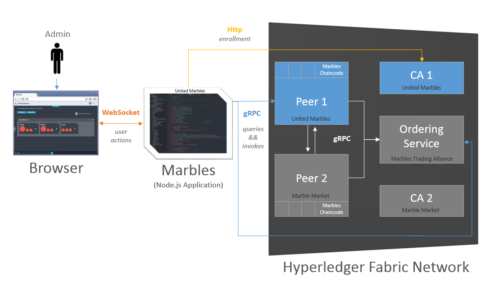
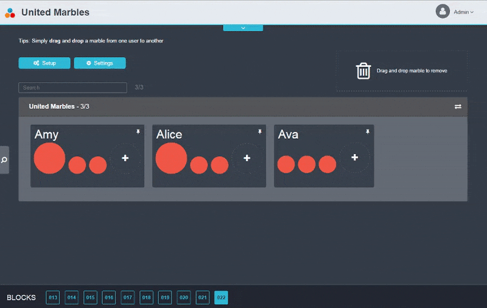
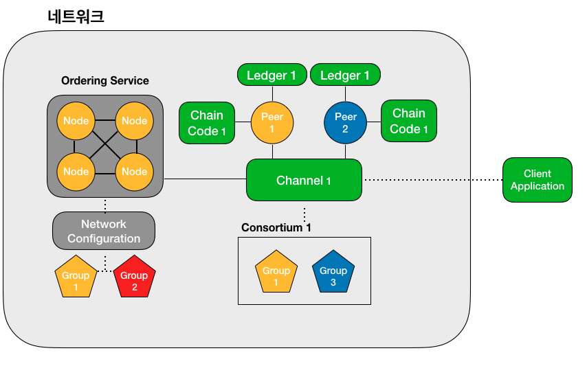

# BlockChain

블록체인의 개념 이해와 Hyperledger Fabric을 사용한 실습 및 연구 [](https://hyperledger-fabric.readthedocs.io/en/latest/index.html) [](
https://www.ibm.com/kr-ko/blockchain/hyperledger?p1=Search&p4=43700052661683012&p5=e&cm_mmc=Search_Google-_-1S_1S-_-AS_KR-_-%ED%95%98%EC%9D%B4%ED%8D%BC%EB%A0%88%EC%A0%80%20%ED%8C%A8%EB%B8%8C%EB%A6%AD_e&cm_mmca7=71700000065178082&cm_mmca8=aud-382859943522:kwd-826282347286&cm_mmca9=CjwKCAjw_qb3BRAVEiwAvwq6Vup_ISx8REow-0sy5_lxcM54YzWUTSeJOnuQAyJmP2BRAGISZirKxxoCG3gQAvD_BwE&cm_mmca10=427974933510&cm_mmca11=e&gclid=CjwKCAjw_qb3BRAVEiwAvwq6Vup_ISx8REow-0sy5_lxcM54YzWUTSeJOnuQAyJmP2BRAGISZirKxxoCG3gQAvD_BwE&gclsrc=aw.ds)

## Hyperledger

- 2015년 12 월 Linux Foundation 주도 하에 산업간 블록체인 기술 발전을 위해 조직된 전 세계적인 Open Source 협업 활동 중
- 금융, 뱅킹, 사물인터넷, 공급망, 제조 및 기술 분야의 총 130개 이상 회원이 Hyperledger Fabric, Composer 등 8개 프로젝트에 현재 참여 중
- 표준화된 개방형 엔터프라이즈급 분산 원장 프레임워크 및 코드 베이스 개발을 진행 중.


## Hyperledger Fabric

- Hyperledger Project 중 가장 활발한 활동 중인 Modular Architecture를 이용한 application/solution 개발을 가능케 해주는 Framework
- 허가형(Permissioned) Private Blockchain의 형태로 인증 관리 시스템에 의해 허가된 사용자만 BlockChain Network에 참여 가능하다.
- 모든 노드가 동일한 원장(Ledger)으로 정보를 공유할 수도 있고, business 목적에 따라 공유하고자 하는 노드 간에만 `Channel`을 제공하여 `별도의 원장 생성`도 가능하다.

### ■ Hyperledger Fabric Component

- 구성요소에는 분산원장(Distributed Ledger), 체인코드(Chaincode), Peer, Orderer가 있다.
	- `분산원장` : 현재의 상태를 저장해 놓은 DB인 `World State`와 상태변화에 대한 모든 Log 기록은 저장되어 있는 `Blockcahin`으로 구성
	- `체인코드` : 원장에 새로운 내용을 업데이트 하거나 기존의 내용을 읽어 오기 위해 필요
		- 체인코드 실행을 요청하는 트랜잭션이 발생하면 3단계`(execution - ordering - validation`)의 과정을 거쳐 원장에 `dApp`을 통해 기록되고 사용자에게 결과를 반환한다.
	- `Peer` : 이 원장과 체인코드를 관리하며 패브리 네트워크를 구성하는 노드로 수행하는 역할에 따라 4가지로 구분
		- `Endorsing peer` : 체인코드 시뮬레이션을 통해 트랜잭션이 적절한지 판단하는 역할 수행. 3단계의 과정 중 execution에 해당
		- `Committing peer` : 모든 peer가 수행하는 역할로, 최신 블록에 대한 검증 수행. 위의 3단계의 과정 중 validation에 해당
		- `Anchor peer` : 다른 조직과의 통신을 위해 다른 조직의 peer와 통신하는 역할 수행
		- `Leader peer` : orderer와 연결되어 최신 블록을 전달 받아 조직 내 다른 peer들에게 전송하는 역할 수행
	- `Orderer` : Endorsing peer들이 시뮬레이션을 통해 적절하다고 판단한 트랜잭션들을 모아서 정렬한 후 실제 블록을 생성하는 노드, 트랜잭션의 순서를 정렬하는 방법에 solo와 kafka방식으로 2가지가 존재
		- `solo` : 보통 테스트용으로 orderer 하나가 정렬 및 블록 생성의 모든 과정을 담당하는 방식
		- `kafka` : 분산 메시징 시스템인 kafka cluster를 통해 orderer가 트랜잭션을 정렬하고 블록을 생성하는 방식


- Fabric에서는 chaincode 실행을 요청하는 transaction부터 ledger에 기록되는 과정을 통틀어 `합의`라고 한다.
- 패브릭에서는 사용자의 권한 및 인증을 위해 MSP(Membership Service Provider)라는 인증 관리 시스템을 사용하는데, 여기에 네트워크 내 노드의 역할과 권한 등이 정의되어 있다.
- 이러한 MSP를 발급하고 관리하는 역할을 하는 기관을 CA(Certificate Authority)라고 한다.하이퍼레저 패브릭에서는 `Fabric-CA 노드`가 그 역할을 수행한다.
- CA노드를 통해 1차적으로 사용자의 서명과 권한 등을 확인하고, peer를 통해 원장에 기록되기 전에 보증 정책(Endorsement Policy)을 준수하는지 확인하는 과정을 거친다.
- 보증 정책은 보통 해당 트랜잭션이 지정된 peer들의 허가를 받아야 한다는 내용인데, 원장을 공유하는 채널 별로 참여자들은 다양한 방식으로 보증 정책을 설정할 수 있다.

---

## Hyperledger Fabric 개발 환경 구축


### ■ 1. Prerequisites [](https://hyperledger-fabric.readthedocs.io/en/latest/prereqs.html)

- Nodejs 8.11.x and above (9.x is not yet supported)
- PostgreSQL 9.5 and above
- jq
- docker-ce
- docker-compose
- GO Lang

#### docker-ce 설치

```bash
$sudo apt update
$sudo apt -y install apt-transport-https ca-certificates curl software-properties-common
$sudo apt install curl
$curl -fsSL https://download.docker.com/linux/ubuntu/gpg | sudo apt-key add -
$sudo add-apt-repository "deb [arch=amd64] https://download.docker.com/linux/ubuntu $(lsb_release -cs) stable"

$sudo apt update
$sudo apt -y install docker-ce
```

- Docker Group 추가 후 현재 사용자 도커 그룹에 편입 후 `재 로그인` 필수

```bash
$sudo usermod -aG docker explorer
$su - explorer
```

#### Docker Compose 설치

```bash
$sudo apt -y install docker-compose
```

#### Go LANG 설치

```bash
$wget wget https://storage.googleapis.com/golang/go1.14.linux-amd64.tar.gz
$sudo tar -C /usr/local -xzf go1.14.linux-amd64.tar.gz
$echo 'export PATH=$PATH:/usr/local/go/bin' >> ~/.profile
$cd
$mkdir go
$echo "export GOPATH=$PWD/go" >> ~/.profile
$echo "export GOROOT=/usr/local/go" >> ~/.profile

$source ~/.profile

$echo "export PATH=$PATH:$GOROOT/bin" >> ~/.profile

$source ~/.profile
```

#### Nodejs, npm 설치

```bash
#nodejs 최신버전 설치
$curl -sL https://deb.nodesource.com/setup_12.x | sudo -E bash -
$sudo apt-get install -y nodejs
$node -v
$npm -v
```

#### GNU make, gcc/g++, libtool, jq 설치

```bash
$sudo apt -y install make gcc g++ libtool

# jq 설치 후 재로그인
$sudo apt-get install jq
$exit
```

---

### ■ 2. Install Samples, Binaries and Using the Test Network

#### Hyperledger Fabric 최신 버전 설치 (v.2.1.1)

```bash
$curl -sSL https://bit.ly/2ysbOFE | bash -s

$echo "export FABRIC_HOME=$HOME/fabric/fabric-samples/bin" >> ~/.profile
$echo "export PATH=$PATH:$FABRIC_HOME" >> ~/.profile
$source ~/.profile
```

### ■ 3. Using the Fabric test network

```bash
$cd /fabric-samples/first-network

# 필요 환경변수 Import 및 인증서와 Artifacts 생성하고 채널명을 결정
# $HOME\fabric_samples\first_network\channel_artifacts에서 생성 파일 확인
$./byfn.sh generate

# 네트워크 기동, 채널 생성(Orderer에 의해), 각 Peer Join, Org의 Anchor Peer 설정(각 Org별), ChainCode Deploy 및 초기화, 블록 초기값 확인 및 변경, 블록 변경 상태 확인
# Container 3개가 프로세스화 되어 실행 된다. (docker ps로 확인)
$./byfn.sh up
 ____    _____      _      ____    _____ 
/ ___|  |_   _|    / \    |  _ \  |_   _|
\___ \    | |     / _ \   | |_) |   | |  
 ___) |   | |    / ___ \  |  _ <    | |  
|____/    |_|   /_/   \_\ |_| \_\   |_|  

Build your first network (BYFN) end-to-end test


# Test Network의 components 확인
$docker ps -a
CONTAINER ID        IMAGE                               COMMAND             CREATED             STATUS                     PORTS                              NAMES
9b620d5c7a85        hyperledger/fabric-peer:latest      "peer node start"   35 seconds ago      Up 30 seconds              7051/tcp, 0.0.0.0:9051->9051/tcp   peer0.org2.example.com
dde8f80a8cd1        hyperledger/fabric-orderer:latest   "orderer"           35 seconds ago      Up 31 seconds              0.0.0.0:7050->7050/tcp             orderer.example.com
93dd07f4675d        hyperledger/fabric-peer:latest      "peer node start"   35 seconds ago      Up 32 seconds              0.0.0.0:7051->7051/tcp             peer0.org1.example.com
7f5dde2870fc        hyperledger/fabric-orderer:latest   "orderer"           14 minutes ago      Exited (2) 8 minutes ago                                      orderer3.example.com
f27dbf286c4b        hyperledger/fabric-orderer:latest   "orderer"           14 minutes ago      Exited (2) 8 minutes ago                                      orderer4.example.com
440e63780867        hyperledger/fabric-orderer:latest   "orderer"           14 minutes ago      Exited (2) 8 minutes ago                                      orderer2.example.com
293a2b5d1d3f        hyperledger/fabric-orderer:latest   "orderer"           14 minutes ago      Exited (2) 8 minutes ago                                      orderer5.example.com
```

#### Creating a channel

```bash
$./network.sh createChannel
========= Channel successfully joined ===========
```

#### Starting a chaincode on the channel

```bash
$./network.sh deployCC
```

---

## Hyperledger Explorer 설치 및 실행

#### Hyperledger Fabric Source 설치

```bash
$mkdir -p $GOPATH/src/github.com/hyperledger
$cd $GOPATH/src/github.com/hyperledger
$git clone -b release-1.4 https://github.com/hyperledger/fabric
```

#### 관련 Utils Setting

```bash
$curl -O https://hyperledger.github.io/composer/latest/prereqs-ubuntu.sh
$chmod u+x prereqs-ubuntu.sh
$./prereqs-ubuntu.sh
```

#### jq 설치

```bash
$sudo apt-get install jq
$exit
$su - explorer
```

#### BlocChain Explorer Source Download

```bash
$cd /home/explorer
$git clone https://github.com/hyperledger/blockchain-explorer.git
```

#### postgreSQL DB 설치 및 Tabel/Data 생성

```bash
$sudo apt-get install postgresql postgresql-contrib
$service postgresql restart
$pg_lsclusters

$cd blockchain-explorer/app/persistence/fabric/postgreSQL
$chmod -R 775 db/
$cd db
$./createdb.sh

$sudo -u postgres psql
$\l
postgres=# \l
                                  List of databases
   Name    |  Owner   | Encoding |   Collate   |    Ctype    |   Access privileges   
-----------+----------+----------+-------------+-------------+-----------------------
 owner     | postgres | UTF8     | en_US.UTF-8 | en_US.UTF-8 | 
 postgres  | postgres | UTF8     | en_US.UTF-8 | en_US.UTF-8 | 
 template0 | postgres | UTF8     | en_US.UTF-8 | en_US.UTF-8 | =c/postgres          +
           |          |          |             |             | postgres=CTc/postgres
 template1 | postgres | UTF8     | en_US.UTF-8 | en_US.UTF-8 | =c/postgres          +
           |          |          |             |             | postgres=CTc/postgres
(4 rows)

# postgreSQL 종료
$\q
```

####  Explorer 설정 파일 수정

- explorer 기본 튜토리얼로 first-network를 지원하므로, first-network.json 파일을 그대로 사용 하되 fabric을 설치하고 네트워크를 생성할 때 만들어진 비공개키의 경로 및 값을 변경해 준다.
- organizations : `adminPrivateKey`, `signedCert`, peers - `tlsCACerts`

[비공개키 값 확인]
```bash
$ls ~/fabric-samples/first-network/crypto-config/peerOrganizations/org1.example.com/users/Admin@org1.example.com/msp/keystore/
```

```bash
$cd blockchain-explorer/app/platform/fabric/connection-profile
$vi first-network.json
```

#### explorer 설치 script 실행 및 기동

```bash
$cd blockchain-explorer

$./main.sh install
Creating an optimized production build...
Compiled successfully.

$./start.sh
************************************************************************************
**************************** Hyperledger Explorer **********************************
************************************************************************************
```

- 구동 후, http://localhost:8080에서 확인 (id:pwd = `admin:adminpw`)


---

## ■ Hyperledger Fabric Transaction [](https://github.com/IBM-Blockchain-Archive/marbles)



- [Step 1] : Client Application에서 SDK를 통해 트랜잭션 제안(transaction proposal)을 발생시킨다.
- [Step 2] : ChainCode의 보증 정책(endorsing policy)에 명시된 노드들(endorsing peers)은 chaincode를 실행한다.
- [Step 3] : 각 결과값은 Client Application에 전달된다.
- [Step 4] : 결과값이 보증 정책을 만족시키면, 결과값은 Ordering Service에 전달된다.
- [Step 5] : Ordering Service는 먼저 도착한 순으로 Block을 만들어 Channel의 모든 Peer들에게 전달한다.
- [Step 6] : 모든 peer는 도착한 block이 보증 정책을 만족시키는지, 장부 상태(ledger state)가 transaction이 일어나는 동안 바뀌지 않았는지 확인한다.
- [Step 7] : 각 peer들은 block을 channel의 chain에 덧붙이며, ledger의 state를 update 한다.

1. Download Fabric Samples

```bash
$cd fabric-samples
$curl -sSL https://raw.githubusercontent.com/hyperledger/fabric/master/scripts/bootstrap.sh -o setup_script.sh
$sudo bash setup_script.sh
$cd javascript

#의존성 라이브러리를 다운로드
$npm install --unsafe-perm
```

2. Start your network

- 많은 시행 착오 끝에 원인은 잘 모르겠지만, `CC_SRC_LANGUAGE`의 설정 값을 `javascript`로 변경하니 정상 수행되었다. 아무래도 `go`의 설정을 변경해 줘야 하는 것 같은데...

[startFabric.sh]

```bash
# go --> javascript
CC_SRC_LANGUAGE=${1:-"javascript"}
```

```bash
$cd ./fabcar
$sudo ./startFabric.sh

#정상 start 확인
$docker ps

CONTAINER ID IMAGE COMMAND                  CREATED              STATUS              					  PORTS                                      NAMES
6672ab9fc475 hyperledger/fabric-peer:latest "peer node start"    About a minute ago   Up About a minute   0.0.0.0:7051->7051/tcp 					 peer0.org1.example.com
75bf8d2a7533 hyperledger/fabric-peer:latest "peer node start"    About a minute ago   Up About a minute   7051/tcp, 0.0.0.0:9051->9051/tcp 			 peer0.org2.example.com
4536708153ba hyperledger/fabric-couchdb "tini -- /docker-ent…"   About a minute ago   Up About a minute   4369/tcp, 9100/tcp, 0.0.0.0:5984->5984/tcp couchdb0
2c57916604db hyperledger/fabric-couchdb "tini -- /docker-ent…"   About a minute ago   Up About a minute   4369/tcp, 9100/tcp, 0.0.0.0:7984->5984/tcp couchdb1
6c5e341ad089 hyperledger/fabric-orderer:latest "orderer"         About a minute ago   Up About a minute   0.0.0.0:7050->7050/tcp 					 orderer.example.com
541a73b5bcf4 hyperledger/fabric-ca:latest "sh -c 'fabric-ca-se…" 2 minutes ago        Up 2 minutes        7054/tcp, 0.0.0.0:9054->9054/tcp           ca_orderer
f4890a0e5f34 yperledger/fabric-ca:latest "sh -c 'fabric-ca-se…"  2 minutes ago        Up 2 minutes        7054/tcp, 0.0.0.0:8054->8054/tcp           ca_org2
4cc489791f42 hyperledger/fabric-ca:latest "sh -c 'fabric-ca-se…" 2 minutes ago        Up 2 minutes        0.0.0.0:7054->7054/tcp                     ca_org1

#User 등록 및 query 수행
$cd javascript
$node enrollAdmin.js
Wallet path: /home/mincloud/fabric-samples/fabcar/javascript/wallet
Successfully enrolled admin user "admin" and imported it into the wallet

$node registerUser.js 
Wallet path: /home/mincloud/fabric-samples/fabcar/javascript/wallet
Successfully registered and enrolled admin user "appUser" and imported it into the wallet

$node query.js

Wallet path: /home/mincloud/fabric-samples/fabcar/javascript/wallet
Transaction has been evaluated, result is: [{"Key":"CAR0","Record":{"color":"blue","docType":"car","make":"Toyota","model":"Prius","owner":"Tomoko"}},{"Key":"CAR1","Record":{"color":"red","docType":"car","make":"Ford","model":"Mustang","owner":"Brad"}},{"Key":"CAR2","Record":{"color":"green","docType":"car","make":"Hyundai","model":"Tucson","owner":"Jin Soo"}},{"Key":"CAR3","Record":{"color":"yellow","docType":"car","make":"Volkswagen","model":"Passat","owner":"Max"}},{"Key":"CAR4","Record":{"color":"black","docType":"car","make":"Tesla","model":"S","owner":"Adriana"}},{"Key":"CAR5","Record":{"color":"purple","docType":"car","make":"Peugeot","model":"205","owner":"Michel"}},{"Key":"CAR6","Record":{"color":"white","docType":"car","make":"Chery","model":"S22L","owner":"Aarav"}},{"Key":"CAR7","Record":{"color":"violet","docType":"car","make":"Fiat","model":"Punto","owner":"Pari"}},{"Key":"CAR8","Record":{"color":"indigo","docType":"car","make":"Tata","model":"Nano","owner":"Valeria"}},{"Key":"CAR9","Record":{"color":"brown","docType":"car","make":"Holden","model":"Barina","owner":"Shotaro"}}]

```

3. Install Dependencies for a Test

```bash
# 만약 Error: EACCES: permission denied 발생시 아래 명령을 수행
$sudo npm install pkcs11js --unsafe-perm=true --allow-root
$sudo npm install
```

4. Download Marbles

```bash
$cd
$git clone http://gopkg.in/ibm-blockchain/marbles.v1
$cd marbles.v1

# gulp 설치
$sudo npm install gulp -g
# marbles를 위한 라이브러리 설치
$sudo npm install

$gulp
```

5. Marbles 사용하기

- 이 단계에서는 환경 설정, 블록체인 네트워크 생성, marbles 앱 및 체인코드가 실행되고 있어야 한다.
- 브라우저를 실행하고 http://localhost:3001 접속

```bash
$gulp marbles_local
```


### Hyperledger Fabric Network 만들기

- Fabric Network를 만들기 위해서 가장 먼저 해야할 일은 Ordering Service를 구동하는 것이다.
- Ordering Service는 블록 안의 트랜잭션 순서를 정하고 연결된 노드들에게 전달하는 기능을 한다.
- Transaction의 순서는 `FCFS(first-come first-serve)` 방식에 의해 결정된다.



- Ordering Service node들은 Ordering Service를 호스팅하는 주체로, 한 그룹이 운영하는 중앙화된 방식에서 여러 그룹의 노드들이 참여하는 분산화된 모델까지 여러 합의 방식을 이용할 수 있다.
- Hyperledger Fabric은 기본적으로 `SOLO(Single Ordering Service Node)`라는 싱글 노드 방식과 Kafka 방식이라는 `CFT(Crash fault tolerance)` 기반 합의 프로토콜을 제공한다. 추후 `PBFT(Practical Byzantine Fault Tolerance)`도 지원할 예정이다.
- Kafka 방식이 가지는 성질인 CFT란 일부 시스템 구성 요소들이 작동하지 않더라도 올바른 합의에 도달할 수 있는 성질을 말한다. 기존 퍼블릭 블록체인에서 주로 사용되는 `BFT(Byzantine fault tolerance)` 시스템은 시스템 구성요소의 기능적 문제뿐 아니라 악의적인 공격(Malicious attack)까지 고려하므로 CFT 시스템과 비교했을 때 더욱 복잡하며 느리다.

- 악의적인 주체(Malicious actors)의 공격 확률이 매우 작을 것으로 간주되므로 Private Blockchain에서는 BFT 기반 합의 프로토콜보다 더 빠르고 간단한 합의 프로토콜 또한 허용 가능한 범위로 간주된다.
- Fabric을 사용하는 조직은 지원하는 합의 방식을 사용하거나 직접 구현할 수 있는데, 이렇게 합의 방식을 선택할 수 있는 특성을 fabric에서는 `교체 가능한 합의 프로토콜(Pluggable consensus)을 지원한다`고 한다.

- Private blockchain에서는 어떤 네트워크 참여자가 어떤 권한을 가지는지 관리하는 것이 매우 중요한데, 그룹 별로 네트워크의 자원에 접근할 수 있는 권한은 관리자에 의해 정해져 Network Configuration에 저장된다.
- 이를 위해 참여자의 ID와 권한을 관리할 주체가 필요하므로, `Certificate Authority(이하 CA)`가 필요하다. 간단히 말해 CA는 디지털 증명서(Digital certificate)를 발급하는 기관이다. 패브릭 네트워크에 참여하는 그룹들은 모두 개별 CA를 이용하게 된다.

- [Step 1] : `Ordering Service` 구동 (Default)
- [Step 2] : Network Configuration 설정
- [Step 3] : Certificate Authority (CA) 설정
- [Step 4] : `Consortium` 구성 : 공동의 목표를 가지고 트랜잭션 내역을 공유하며 협력하는 집단
- [Step 5] : 컨소시엄이 이용하는 `Channel` 만들기 (그룹1과 그룹3이 채널1을 만든다.)
	- Channel은 hyperledger fabric에서 매우 중요한 컨소시엄 내 그룹간 커뮤니케이션 메커니즘으로 데이터 분리(data isolation)와 기밀화를 가능케 하며, 채널용 장부(channel-specific ledger)는 채널 사용 허가를 받은 컨소시엄 멤버들만이 접근 가능하다.
	- Network Configuration과 별개로 채널 설정이 존재하여, 채널 설정 정보에는 Channel에 접근할 수 있는 peer의 권한 정보등 채널 운영에 필요한 모든 정보를 담고있다.
	- 채널 설정 정보는 블록에 담겨 장부에 기록된다. Channel은 네트워크 안에 존재하지만 네트워크 설정과 채널 설정 사이 중복되는 설정이 없으므로, 네트워크 설정이 변경되어도 채널 설정에 직접적인 영향은 없다.
	- Privacy를 유지하며 효율적인 데이터 공유가 가능하게 만들기 때문에, 채널은 Public blockchain은 가지지 못하는 장점을 제공하는 중요한 기능이다. 한 네트워크 안에는 여러 컨소시엄들이 사용하는 채널들이 존재할 수 있다.
	- 채널1에는 장부도 없고, 이를 호스팅할 peer도 없으므로, 그룹1의 피어1을 추가하기 위해 peer1은 오더링 서비스에 참여 요청을 보내면, 오더링 서비스는 채널1의 설정을 확인하고 peer1에게 접근 권한을 준다. peer1이 접근 권한을 받고 나면 peer1은 채널1의 Ledger1을 호스팅한다.
- [Step 6] : `Smart Contract (Chaincode)` (피어1에 체인코드1을 설치 -> 피어2에 체인코드1을 설치(다른 언어여도 관계 없음) -> 체인코드1을 인스턴스화 한다.)
	- Smart contract는 장부에 저장된 상태(state)를 업데이트 하는 코드(code)이다. 하이퍼레져 패브릭에서는 Chaincode라고 하며, 패브릭은 체인코드 언어로 현재 Go와 node.js를 지원한다.
	- 체인코드를 사용하려면, 우선 피어 노드에 체인코드가 설치(install)되어야 한다. 피어에 체인코드를 설치하고 나면, 해당 피어는 그 체인코드의 구현 로직을 담게 된다. 특정 채널을 호스팅 하는 모든 피어들에 같은 체인코드를 설치할 필요는 없으며, 몇 개의 피어들만 선택하여 체인코드를 설치할 수 있다.
	- 체인코드가 어떤 피어에 설치했다고 해서 바로 사용할 수 있는 것은 아니다. 그 피어가 호스팅 하는 채널에 연결된 다른 구성 요소들은 어떤 체인코드가 설치됐다는 사실을 알 수 없기 때문에 체인코드를 사용하려면 구현 로직이 아닌 해당 체인코드의 `인터페이스`(코드의 기능에 대한 규약. 코드 구현체는 이 인터페이스에 따라 구현된다.)를 다른 피어들에게 알리는 인스턴트화가 필요하다. 인스턴트화는 ‘instantiate’ 명령어를 이용하여 이루어질 수 있다.
	- 체인코드가 피어에 설치되고, 인스턴트화까지 이루어지고 나면 Client application에 의해서 체인코드가 호출(invoke)될 수 있다.
	- 일부 노드에만 체인코드의 구현 로직을 설치한다는 점은 기존의 퍼블릭 블록체인과 구분되는 차이점이다. 퍼블릭 블록체인에서는 모든 노드가 같은 스마트 컨트랙트(Smart contract)를 실행하고, 상호 검증하게 되므로 사용되는 시스템 구조는 어떤 특정 입력 값을 대입하면 항상 같은 출력 값을 출력하는 특성으로 결정적(Deterministic)이어야 한다.
	- 기존의 퍼블릭 블록체인의 시스템에서는 보안을 위해 여러 기능(Network access,I/O stream, File W/R등)이 제한되어야 해서, 이더리움이 개발될 때도 이미 여러 훌륭한 프로그래밍 언어가 시중에 존재함에도 굳이 솔리디티(`Solidity`)라는 Smart contract용 제한적인 언어가 제안되었다.
	- 하이퍼레져 패브릭에서는 일부 노드만 체인코드를 실행하고 결과값을 네트워크에 전파하기 때문에 프로그래밍 언어가 꼭 결정적일 필요는 없다. 또, 무한루프등의 문제가 발생해도 영향은 일부 노드로 제한되며, 그 노드는 실행을 종료할 수 있기 때문에 프로그래밍 언어 선택시 퍼블릭 블록체인만큼 엄격할 필요가 없다.


[Network 구성 요소]

- Peer : 블록체인의 멤버로 하이퍼레저 패브릭에서 실행된다.
- CA : CA(인증 기관)는 블록체인 네트워크를 유지하는 책임을 맡고 있다. 응용 프로그램을 사용하는 고객들을 위한 거래 증명서를 제공한다.
- Orderer : Order 또는 주문 서비스는 블록으로 트랜잭션을 패키징하는 주된 책임이 있는 블록체인의 네트워크 구성
- Users : 블록체인과 상호작용할 수 있는 권한이 부여된 개체. 
- Blocks : 무결성을 확인하기 위한 트랜잭션과 해시를 포함하는 블록
- Transactions or Proposals : 블록체인 원장과의 상호작용을 나타낸다. 원장의 열람 또는 작성요청은 거래/제안으로 송부한다.
- Ledger : 피어의 블록체인을 위한 저장고. 트랜잭션 매개변수와 키 값 쌍으로 구성된 실제 블록 데이터를 포함하며 체인 코드로 쓰여져 있다.
- Chaincode : Hyperledger Fabric이 스마트 계약을 대변한다. 자산과 자산에 대한 모든 규칙을 정의한다.
- Assets : ledger에 존재하는 entity로 key-value쌍으로 구성